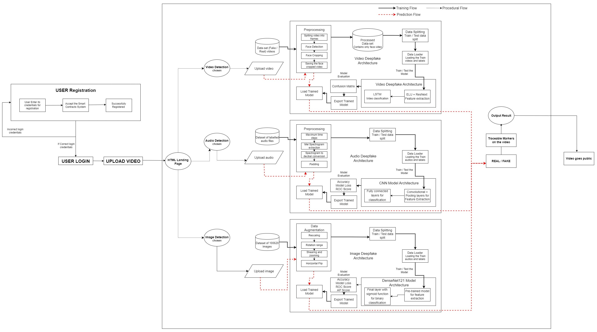

# Multi-Modal Deepfake Detection

A deepfake detection system that works across three media types — images, audio, and video — through a single unified web interface. Each modality uses a different model architecture suited to its domain, and the Flask-based frontend lets users upload files and get real-time classification results with confidence scores.



---

## What It Does

The system accepts an image, audio clip, or video file and classifies it as real or fake. Under the hood, each media type is handled by a specialized detection pipeline:

- **Image detection** uses a Vision Transformer (ViT) fine-tuned for binary classification (real vs. deepfake). The model processes 224x224 RGB inputs and outputs softmax probabilities for each class.

- **Audio detection** uses a Wav2Vec2 model fine-tuned for sequence classification. Raw audio is loaded at 16kHz, passed through the feature extractor, and classified as bonafide or spoofed.

- **Video detection** uses a ResNeXt-50 backbone feeding into an LSTM. Frames are extracted sequentially from the video, resized to 112x112, normalized, and passed through the CNN-LSTM pipeline. The LSTM captures temporal inconsistencies across frames that single-frame analysis would miss.

All three pipelines return a classification label and a confidence percentage.

---

## Architecture

The project is organized into four main components:

```
Multi-Modal-Deepfake-Detection/
├── AudioDeepfakeDetection/       # Audio model training and evaluation (Jupyter notebook)
├── ImageDeepfakeDetection/       # Image model evaluation and benchmarks (Jupyter notebook)
├── VideoDeepfakeDetection/       # Video preprocessing + ResNeXt-LSTM training (Jupyter notebooks)
├── Common GUI/                   # Flask web app that ties everything together
│   ├── app.py                    # Main application — routes, model loading, inference logic
│   ├── model/                    # Pre-trained model configs (weights downloaded separately)
│   │   ├── image_model/          # ViT config (ViTForImageClassification)
│   │   └── audio_model/          # Wav2Vec2 config (Wav2Vec2ForSequenceClassification)
│   ├── templates/                # HTML pages for each detection mode
│   └── static/                   # CSS, JS, and UI assets
├── sample_files/                 # Test samples for each modality (real + fake)
└── requirements.txt
```

### Model Details

| Modality | Architecture | Input | Framework |
|----------|-------------|-------|-----------|
| Image | ViT (Vision Transformer) | 224x224 RGB | HuggingFace Transformers |
| Audio | Wav2Vec2 | 16kHz waveform | HuggingFace Transformers |
| Video | ResNeXt-50 + LSTM | 100 frames at 112x112 | PyTorch |

The image and audio models use HuggingFace's `AutoModelForImageClassification` and `AutoModelForAudioClassification` APIs respectively. The video model is a custom PyTorch `nn.Module` that chains a pretrained ResNeXt-50 (with the classification head removed) into a single-layer LSTM with 2048 hidden units, followed by dropout and a linear classifier.

---

## Screenshots

<p>
  
  
</p>
<p>
  
  
</p>
<p>
  
  
</p>

---

## Setup

### Prerequisites

- Python 3.8+
- pip
- (Optional) CUDA-compatible GPU for faster inference

### Installation

```bash
git clone https://github.com/jonathan-thoms/Multi-Modal-Deepfake-Detection.git
cd Multi-Modal-Deepfake-Detection
pip install -r requirements.txt
```

**Note on dependencies:**
- `face-recognition` requires `dlib`, which in turn needs CMake and (on Windows) Visual Studio Build Tools. Install `dlib` separately if the pip install fails: `pip install cmake && pip install dlib`
- If you're using a GPU, make sure your PyTorch installation matches your CUDA version. See [pytorch.org/get-started](https://pytorch.org/get-started/locally/).

### Downloading Model Weights

The repository includes model config files but not the trained weights (they're excluded via `.gitignore` due to size). You need to download them separately:

- **Image model:** Place the ViT weights in `Common GUI/model/image_model/`
- **Audio model:** Place the Wav2Vec2 weights in `Common GUI/model/audio_model/`
- **Video model:** Place `model_97_acc_100_frames_FF_data.pt` in `Common GUI/model/`

The image and audio models are loaded through HuggingFace's `from_pretrained()`, so the weights file should follow the standard HuggingFace model format (e.g., `pytorch_model.bin` or `model.safetensors`).

### Running the Application

```bash
cd "Common GUI"
python app.py
```

The Flask server starts on `http://127.0.0.1:5000`. Open it in your browser, pick a detection mode (image / audio / video), upload a file, and the system returns the classification result.

---

## How the Video Pipeline Works

The video detection pipeline is the most involved of the three, so it's worth explaining separately.

1. **Frame extraction** — OpenCV reads the video frame by frame using `VideoCapture`.
2. **Preprocessing** — Each frame is resized to 112x112, converted to a tensor, and normalized using ImageNet statistics (mean=[0.485, 0.456, 0.406], std=[0.229, 0.224, 0.225]).
3. **Batching** — The first 100 frames are stacked into a single tensor of shape `(1, 100, 3, 112, 112)`.
4. **CNN feature extraction** — The ResNeXt-50 backbone (without its final FC layers) processes each frame independently, producing a 2048-dimensional feature vector per frame.
5. **Temporal modeling** — The sequence of 2048-d vectors is fed through the LSTM, which learns temporal patterns. The hidden state at the final timestep is used for classification.
6. **Classification** — A dropout layer (p=0.4) followed by a linear layer maps the LSTM output to 2 classes (real/fake). Softmax gives the confidence score.

The training notebook (`VideoDeepfakeDetection/Model_and_train_csv.ipynb`) and preprocessing notebook (`VideoDeepfakeDetection/preprocessing.ipynb`) document the full training procedure, including face cropping using the `face_recognition` library and dataset preparation from FaceForensics++.

---

## Sample Files

The `sample_files/` directory contains test data for quick validation:

- **Images:** 5 real + 5 fake face images
- **Audio:** 3 real + 5 fake audio clips
- **Video:** 5 real + 5 fake video samples

These can be used to verify the detection pipeline works correctly after setup.

---

## Tech Stack

- **Deep Learning:** PyTorch, TensorFlow/Keras, HuggingFace Transformers
- **Computer Vision:** OpenCV, torchvision, Pillow
- **Audio Processing:** librosa, soundfile
- **Web Framework:** Flask
- **Data Science:** NumPy, pandas, scikit-learn, matplotlib

---

## License

This project is for academic and research purposes.
